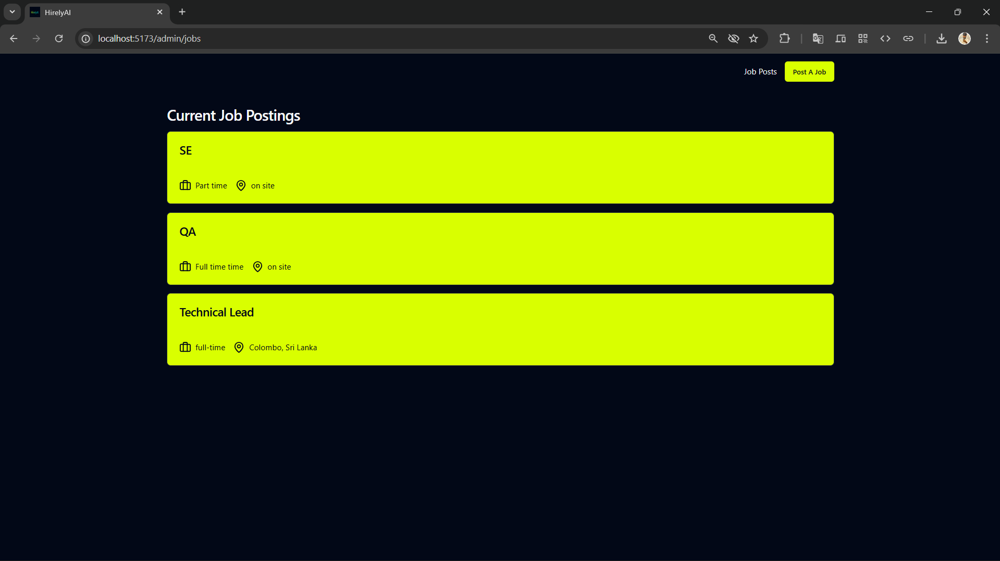
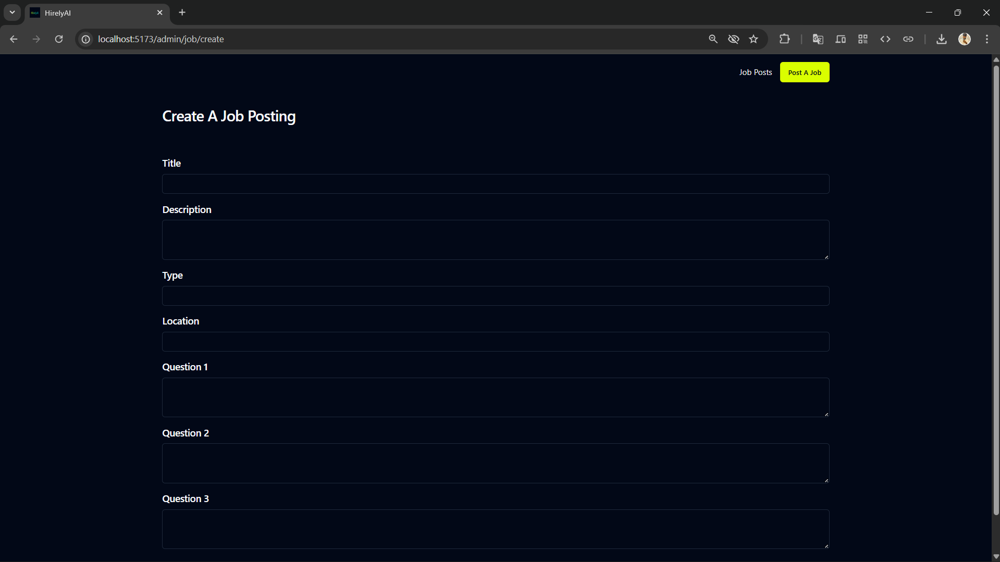
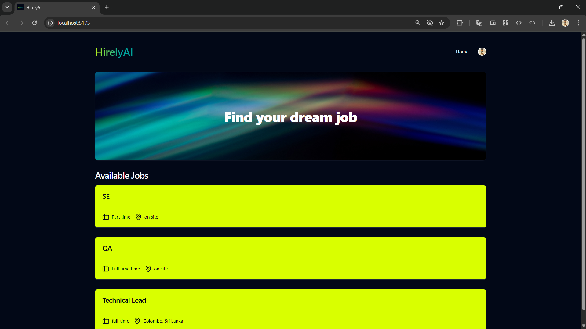
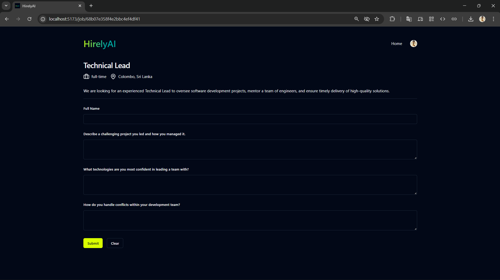

# HirelyAI - AI-Driven Job Posting & Applications (Clerk + OpenAI)

Admins post jobs, candidates apply with answers, and a custom OpenAI model rates each answer as **Bad / Moderate / Good** based on the job role and response quality.

- **Backend:** Node.js + Express + TypeScript + Mongoose  
- **Frontend:** React (Vite) + JavaScript  
- **Auth:** Clerk  
- **AI:** OpenAI (custom model / prompt logic)

---

## ✨ Features

- **Admin**
  - Create, list, update, delete job posts (title, type, location, description, questions)
  - View all applications for a specific job
  - See AI rating for each candidate’s answers (**Bad / Moderate / Good**)

- **Candidate**
  - Browse job list
  - Submit a job application with answers to the job’s questions
  - Receive an AI-evaluated rating

---

## 🧱 Monorepo Structure

```

job-app/
├─ backend/       # Express + TS (Clerk, OpenAI, MongoDB)
├─ frontend/      # React + Vite (JS)
├─ .gitignore
├─ README.md
└─ LICENSE        # optional

````

---

## 🧰 Tech Stack

- **Frontend:** React (Vite), JavaScript, React Router, Shadcn UI & Lucide  
- **Backend:** Node.js, Express, TypeScript, Mongoose/MongoDB  
- **Auth:** Clerk  
- **AI:** OpenAI (custom evaluation model)  
- **Validation:** Zod  
- **Other:** dotenv, CORS, Axios  

---

## ⚙️ Environment Setup

1. **Clone the repo:**
   ```bash
   git clone https://github.com/<your-username>/job-app.git
   cd job-app


2. **Setup environment variables:**

   **Backend**

   ```bash
   cp backend/.env.example backend/.env
   # Fill values: MONGODB_URI, CLERK keys, OPENAI_API_KEY, etc.
   ```

   **Frontend**

   ```bash
   cp frontend/.env.example frontend/.env
   # Fill values: VITE_API_BASE_URL, VITE_CLERK_PUBLISHABLE_KEY
   ```

---

## ▶️ Run Locally

### Backend

```bash
cd backend
npm install
npm run dev    # server: http://localhost:8000
```

### Frontend

```bash
cd ../frontend
npm install
npm run dev    # app: http://localhost:5173
```

> Ensure CORS on backend allows the frontend origin.

---

## 🔐 Authentication (Clerk)

* Backend protects routes with Clerk middleware (bearer token).
* Frontend uses `VITE_CLERK_PUBLISHABLE_KEY` and Clerk React SDK.

---

## 🧠 AI Scoring

* Backend calls OpenAI with the candidate’s answers + job role context.
* Returns a normalized rating: **"bad" | "moderate" | "good"**.
* Requires `OPENAI_API_KEY` in backend `.env`.

---

## 🔌 Example API

### Create a Job (Admin)

```http
POST /jobs
Authorization: Bearer <token>
Content-Type: application/json

{
  "title": "Technical Lead",
  "description": "Lead the team...",
  "type": "full-time",
  "location": "Colombo, Sri Lanka",
  "questions": [
    "Describe a challenging project...",
    "Which technologies can you lead?",
    "How do you handle team conflicts?"
  ]
}
```

### Apply to a Job (Candidate)

```http
POST /jobApplications
Content-Type: application/json

{
  "jobId": "<job_id>",
  "fullName": "Jane Doe",
  "answers": [
    "I led a microservices migration...",
    "Node/React/AWS leadership...",
    "Transparent communication, mediation, ..."
  ]
}
```

---

## 🖼 Screenshots

Create a folder: `frontend/public/screenshots/`
Add your PNG/JPGs there, then reference like:


### Admin – Job List


### Admin – Applications


### Candidate – Job List


### Candidate – Apply



## 🚀 Deployment Notes

* **Frontend:** Vercel/Netlify

  * Set `VITE_API_BASE_URL` and `VITE_CLERK_PUBLISHABLE_KEY` in project env.
* **Backend:** Render/Railway/EC2

  * Set `PORT`, `MONGODB_URI`, `CLERK_*`, `OPENAI_API_KEY`, `CORS_ORIGIN`.
* **MongoDB:** Use Atlas; allow your server IP/domain.
* **Clerk:** Add app domains (frontend + backend) to allowed origins.


## 📝 License

MIT © <Dulsara Manakal>

---
